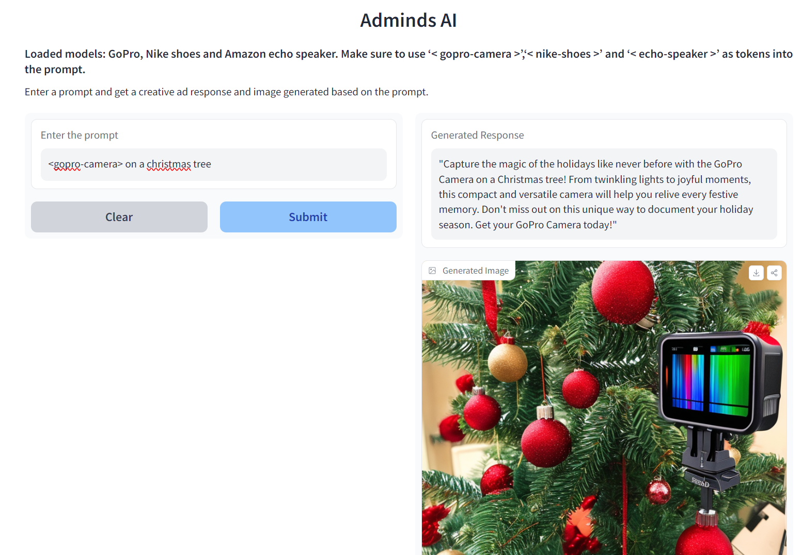

# AdMinds AI (Ads Generation)

Adminds AI is a powerful tool designed to streamline your social media advertising. With a simple prompt, our application generates captivating text and eye-catching images that are tailored for effective social media marketing. Whether you're promoting your own products on ecommerce websites.(We nitpicked and trained on products like GoPro camera, Nike shoe and an Amazon Echo speaker)

Adminds AI delivers engaging content ready for your campaigns. Elevate your social media strategy with Adminds AI's automated ad generation, ensuring your brand stands out in the digital landscape.

## Methodology Overview
Adminds AI is a comprehensive ad generation platform that seamlessly blends cutting-edge technologies. The OpenAI API powers dynamic text responses, creating engaging ad content from user prompts. Gradio's user interface enhances interaction, while stable diffusion models fine-tuned on a rich image dataset generate captivating visuals. Hugging Face's community library efficiently manages trained models, and Hugging Face Spaces simplifies deployment for user accessibility. Adminds AI harmonizes text generation, image synthesis, and deployment, offering an all-inclusive solution for crafting compelling ads tailored for social media marketing campaigns.

## Textual Inversion

Textual Inversion is a technique that enhances the capabilities of transformer models, like those used in diffusion models, by learning a new token embedding. This embedding, denoted as v*, is derived from a special token S*. It enables the diffusion model to better understand text prompts and new concepts using only a few example images. This process involves a generator model and noisy training images. 

The generator predicts less noisy image versions, and the token embedding v* is refined based on the generator's performance. If successful, this enhanced embedding provides more valuable information to the diffusion model, resulting in clearer images with reduced noise. The optimization of this token embedding occurs over numerous iterations, involving exposure to diverse prompts and image variations.

